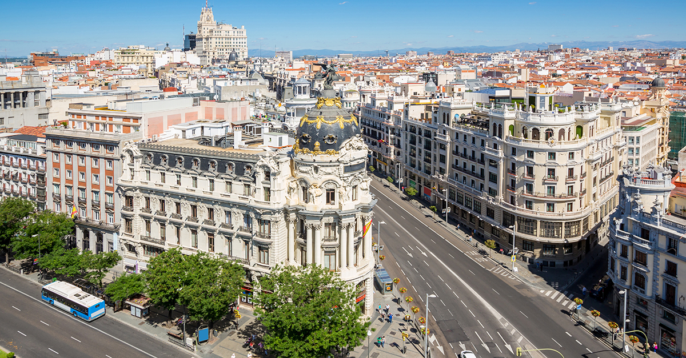
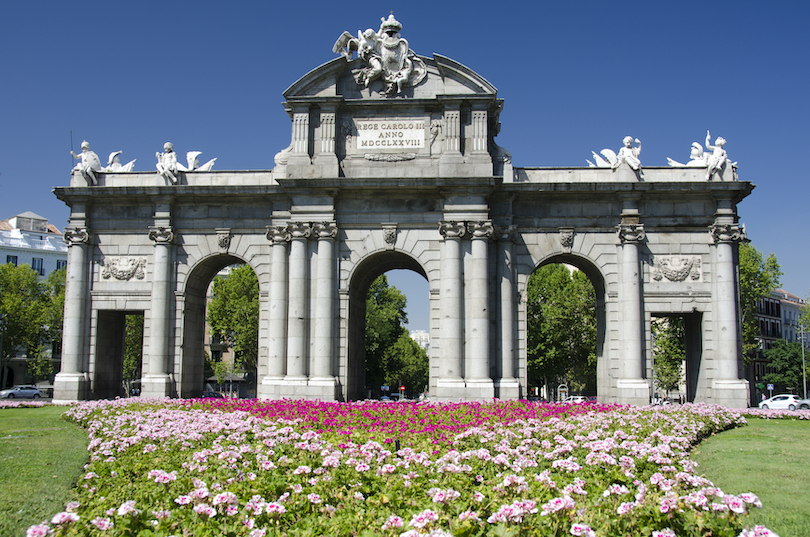
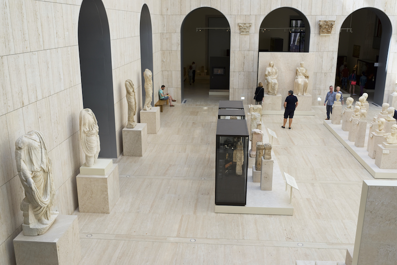
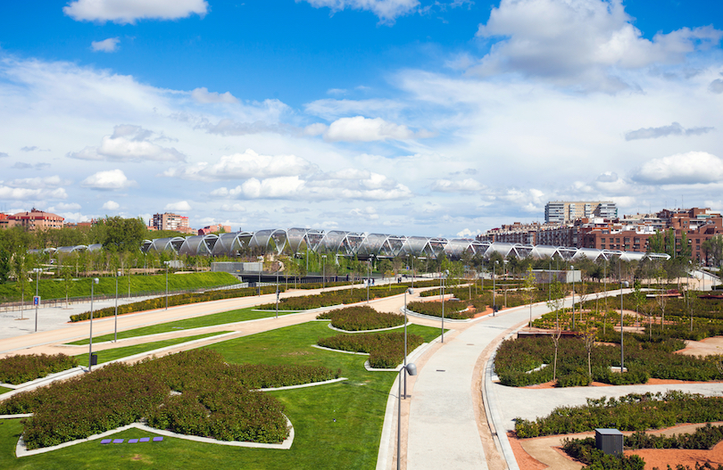

<!DOCTYPE html>
<html>
  <head>
    <meta charset="UTF-8">
    <title>MADRID</title>
    <link rel="stylesheet" href="Madrid.css">
  </head>
  <body>
    <h1>Madrid</h1>
    
    
Madrid, Spain's central capital, is a city of elegant boulevards and expansive, manicured parks such as the Buen Retiro. It’s renowned for its rich repositories of European art, including the Prado Museum’s works by Goya, Velázquez and other Spanish masters. The heart of old Hapsburg Madrid is the portico-lined Plaza Mayor, and nearby is the baroque Royal Palace and Armory, displaying historic weaponry.
 

    <h2>Sights in Madrid</h2>

    <ul>
      <li>Puerta de Alcala</li>
      
      <y>Copyright © 2022 Touropia.com</y> 

      <li>Museo Arqueologico Nacional</li>
      
      <y>Copyright © 2022 Touropia.com</y> 

      <li>Madrid Río Park</li>
      
      <y>Copyright © 2022 Touropia.com</y> 

    </ul>
    <a href="index.html">Return to home page</a>
  </body>
  
  
</html>
